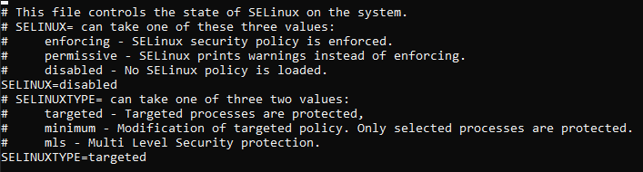
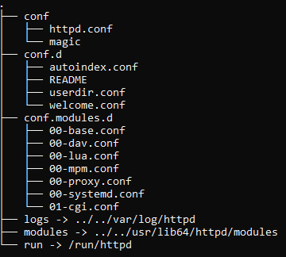
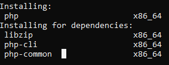
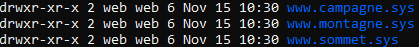
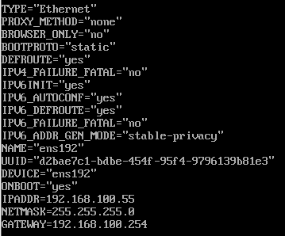

# 2-Désactivation de SELinux
## Question A
SELinux est une architecture de securité qui permet de definir les controles d'accés pour les applications les processus et les fichiers d'un systeme.

## Question B
on peut desactiver temporairement SELinux avec la commande 

    setenforce 0
ou
    echo 0 > /sys/fs/selinux/enforce

## Question C
On modifie la valeur dans le fichier de configuration 

# 3-Désactivation momentané du pare-feu.

 ## Question A

    systemctl disable firewalld

## Question B

    systemctl status firewalld

# 4-Installation du service Apache

 ## Question A
 En pourcentage d'utilisation les trois principaux serveurs WEB utilisés sous linux sont :
 - Apache (42,5 %)
 - Nginx (40,1 %)
 - IIS (11,9 %)

 ## Question B
pour trouver le paquet avec le serveur apache

    yum search apache
pour l'installer 

    yum install httpd

## Question C
pour demarrer le serveur apache 

    systemctl start httpd

## Question D
Pour verifier que le service apache est fonctionnel

    systemctl status httpd
    systemctl is-enabled httpd

## Question E
Cette commande nous donne le chemin d'acces du service, son PID, sa documentation et son statut

# 5-Configuration du service Apache

## Question A
les fichiers de configurations du serveur apache se trouve dans

    /etc/httpd

## Question B

- le fichier de configuration principale se trouve dans conf
- conf.d est un repertoire qui contient des fichiers de configuration
- conf.modules.d est un repertoire qui contient des fichiers de configurations liées au modules

## Question C
le fichier de configuration principale se trouve dans conf/httpd.conf

## Question D
C'est un repertoire qui contient des fichiers de configurations 

## Question E
C'est un repertoire qui contient des fichiers de configurations liées au modules

## Question F
les modules permettent aux administrateurs des serveurs apaches d'activer ou desactiver certaines fonctionnalités.

## Question G
Ils sont stockés dans 

    /usr/lib64/httpd/modules

## Question H
Ils sont stockés dans 

    /var/log/httpd

# 6-Exploration de la configuration de base

## Question A
Permet de definir le repertoire courant ou page web seront recuperés par le serveur linux

## Question B
il pointe vers 

    /var/www/html

## Question C
le directive listen permet d'indiquer au serveur les ports et les addresses sur lequelles il peut accepter des requetes 

## Question D
Regroupe un ensemble de directives qui ne s'appliquent qu'au répertoire concerné du système de fichiers, à ses sous-répertoires, et à leur contenu.

## Question E
permet de specifier le types de directives autorisées dans les fichiers .htaccess

Vérifie si un utilisateur authentifié a une autorisation d'accès accordée par un fournisseur d'autorisation
## Question F
permet d'activer la page web standard si aucune page web n'est present dans le fichier  /var/www/html

## Question G
Active l'interface de controle du serveur Apache

# 7-Tests et Installations complémentaires

## Question A

## Question B
ce paquet permet la communication entre le serveur et php 

## Question D
on execute la commande 

    php --version
On peut alors observer que l'on posséde la version 5.4.16 de php

## Question E
si l'on crée un fichier .php à la racine de notre serveur est que l'on ajoute 

    <?php phpinfo(); ?>
à l'interieur du fichier on peut ensuite depuis l'interface web acceder à la configuration compléte de notre serveur apache

## Question f
- php-gd permet de modifier des images, récupérer des informations sur ces images, voir même, créer nous-même nos propres images.

- php-mysqlnd remplace le client mysql classique et l'adapte au serveur php

- php-pdo nous offre une interface permettant d'acceder à notre base de données depuis PHP

- php-mbstring fournit un module MBSTRING pour PHP

# 8- Configuration avancée

## Question A 
dans l'ordre on commence par installer le paquet avec 

    yum install vsftpd

puis on le lance avec 

    systemctl enable vsftpd
    systemctl start vsftpd
puis on verifie l'installation avec 

    systemctl status vsftpd

## Question B
    mkdir www.campagne.sys
    mkdir www.montagne.sys
    mkdir www.sommet.sys

## Question C

# 9-Configuration réseau

## Question A

## Question B
la commande nmcli permet le controle du NetworkManager

## Question C
Network-Manager est l'outil de gestion des connexions réseau d'Ubuntu. Son utilité est la création et la configuration des accès à divers types de réseaux 

## Question D
/etc/resolv stocke la configuration generé automatiquement par le NetworkManager

## Question E
on peut verifier la bonne connectivité de notre vm avec la commande nmcli

## Question F
la machine peut bien joindre free.fr à l'aide de la commande 

    ping www.free.fr 

## Question G
avec la commande 

    ping 192.168.100.108
notre vm nous permet bien de ping des vm sur le meme reseau

# 10-IP Virtuelles

## Question A
